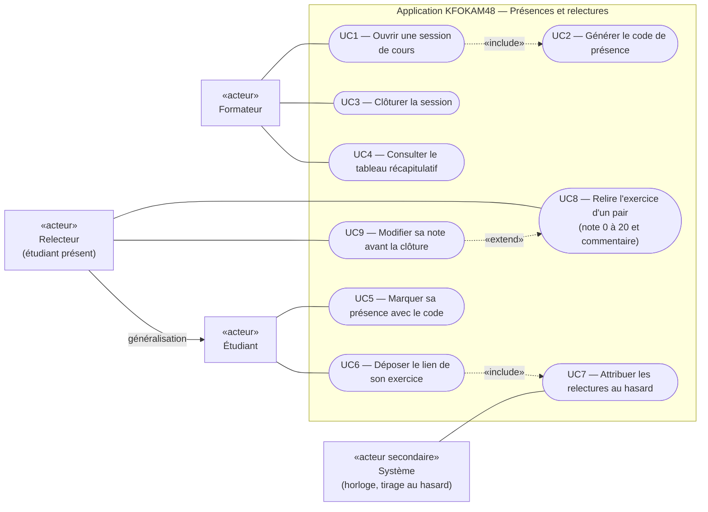

# D1 — Diagramme de cas d'utilisation

Candidate : Tedjou Nguimzi Cyntia — Matricule 265. Référence : `docs/CAHIER_DES_CHARGES.md`, sections 2 et 4.

## Correspondance avec les exigences

| Cas d'utilisation | Acteur | Exigence | Route | Règles |
|---|---|---|---|---|
| UC1 — Ouvrir une session de cours | Formateur | EF1 | `POST /api/sessions` | RG1, RG10 |
| UC2 — Générer le code de présence | (inclus dans UC1) | EF1 | `POST /api/sessions` | RG1, RG10 |
| UC3 — Clôturer la session | Formateur | EF8 | `POST /api/sessions/{id}/cloture` (extension H3) | RG1, RG9 |
| UC4 — Consulter le tableau récapitulatif | Formateur | EF7 | `GET /api/tableau` | RG11 |
| UC5 — Marquer sa présence | Étudiant | EF2 | `POST /api/presences` | RG1, RG3 |
| UC6 — Déposer le lien de son exercice | Étudiant | EF3 | `POST /api/exercices` | RG4, RG5 |
| UC7 — Attribuer les relectures au hasard | Système | EF4 | traitement interne | RG2, RG7, RG8 |
| UC8 — Relire l'exercice d'un pair | Relecteur | EF5 | `POST /api/relectures/{id}` | RG2, RG6 |
| UC9 — Modifier sa note avant la clôture | Relecteur | EF6 | `POST /api/relectures/{id}` | RG9 (décision Q10) |

## Notes

- **Relecteur → Étudiant (généralisation) :** le relecteur est un étudiant présent à la session à qui le système a attribué l'exercice d'un pair. Il conserve donc les cas d'utilisation de l'étudiant.
- **UC6 « include » UC7 :** chaque dépôt déclenche une tentative d'attribution. Une nouvelle présence (UC5) déclenche aussi l'attribution des exercices encore sans relecteur (EF4).
- **UC9 « extend » UC8 :** la modification n'est possible que si la relecture est déjà rendue et que la session est encore ouverte (RG9).
