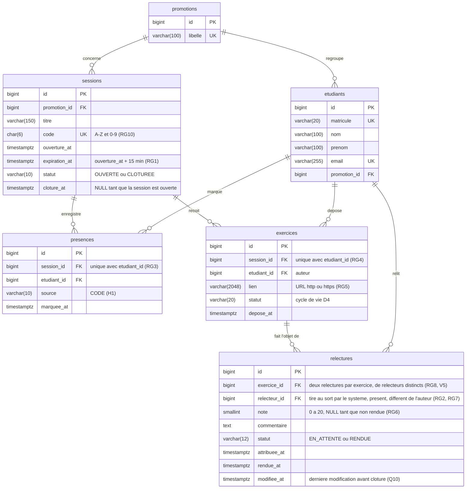

# D2 — Modèle de données (PostgreSQL)

Candidate : Tedjou Nguimzi Cyntia — Matricule 265. Référence : `docs/CAHIER_DES_CHARGES.md`, sections 6 et 7. Mis à jour pour la double relecture croisée, évolution imposée à l'Étape 3 (section 7.4, migration V5).

Les tables principales du domaine sont `sessions`, `presences`, `exercices` et `relectures`. Les tables `promotions` et `etudiants` sont des données de référence pré-chargées (H4).

## Contraintes d'intégrité

| Table | Contrainte | Type | Règle |
|---|---|---|---|
| `sessions` | `code` unique | `UNIQUE` | RG10 |
| `sessions` | `expiration_at = ouverture_at + 15 min` | `CHECK` | RG1 |
| `sessions` | `statut` dans (`OUVERTE`, `CLOTUREE`) | `CHECK` | RG9 |
| `presences` | couple (`session_id`, `etudiant_id`) unique | `UNIQUE` | RG3 : `409 DEJA_PRESENT`, y compris en cas d'envois simultanés |
| `exercices` | couple (`session_id`, `etudiant_id`) unique | `UNIQUE` | RG4 : `409 EXERCICE_DEJA_DEPOSE` |
| `exercices` | `statut` dans (`DEPOSE`, `EN_RELECTURE`, `RELU`, `DEFINITIF`, `SANS_RELECTURE`) | `CHECK` | D4 |
| `relectures` | couple (`exercice_id`, `relecteur_id`) unique | `UNIQUE` | RG8 : un même relecteur au plus une fois par exercice. Remplace `UNIQUE (exercice_id)` depuis la migration V5 (double relecture, Étape 3) |
| `relectures` | deux relectures au plus par exercice | contrôle applicatif, sous verrou de l'exercice (le nombre de lignes n'est pas exprimable par une contrainte simple) | RG8 (Étape 3) |
| `relectures` | `note` entre 0 et 20 ou `NULL` | `CHECK` | RG6 |
| `relectures` | `statut = 'RENDUE'` si et seulement si `note` et `rendue_at` sont renseignés | `CHECK` | EF5 |
| `relectures` | relecteur différent de l'auteur et présent à la session | contrôle applicatif (règle portant sur plusieurs tables) | RG2, RG7 |

## Index

- `presences (session_id)` et `exercices (session_id)` : attribution des relectures et contrôles par session.
- `relectures (relecteur_id, statut)` : calcul de `relecturesEnAttente` (RG11).
- `etudiants (promotion_id)` et `sessions (promotion_id)` : tableau récapitulatif.
- `presences (etudiant_id)` et `exercices (etudiant_id)` : calculs du tableau récapitulatif par étudiant (RG11, ENF4). Ajoutés par la migration V4.
- `relectures (exercice_id, relecteur_id)` : index de la contrainte unique de la migration V5 ; il commence par `exercice_id` et sert donc les recherches des relectures d'un exercice.

## Choix de conception

- **Formateur non enregistré :** `POST /api/sessions` ne reçoit que `titre` et `promotionId`. Aucune table `formateurs` ni colonne `sessions.formateur_id` n'est donc nécessaire en version 1. Elles seront ajoutées avec l'authentification (H4).
- **Relecteur attribué, pas transmis :** `relectures.relecteur_id` est renseigné par le tirage au sort (RG8), jamais par la requête. `POST /api/relectures/{id}` ne reçoit que `note` et `commentaire`.
- **Clôture et définitivité :** une note est définitive lorsque `sessions.statut = 'CLOTUREE'` (RG9). Cet état n'est pas dupliqué dans `relectures` : il est dérivé de la session.
- **Dates :** `timestamptz`, en UTC (ENF6). L'expiration du code se compare à l'horloge du serveur.
- **Nom de la table `sessions` :** au pluriel, comme toutes les tables, ce qui évite toute confusion avec le mot-clé SQL `SESSION`.
