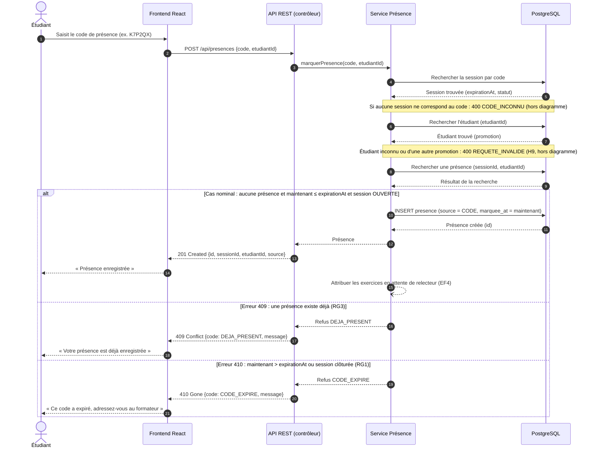

# D3 — Diagramme de séquence : « Marquer sa présence »

Candidate : Tedjou Nguimzi Cyntia — Matricule 265. Référence : EF2, RG1, RG3, H6, H9 (`docs/CAHIER_DES_CHARGES.md`) et `POST /api/presences` (`api/contrat.yaml`).

Le diagramme couvre le cas nominal (`201`) et les deux erreurs métier `409 DEJA_PRESENT` et `410 CODE_EXPIRE`.

## Notes

- **Ordre des contrôles (H6) :** `CODE_INCONNU`, puis le contrôle de l'étudiant (`REQUETE_INVALIDE` s'il est inconnu ou d'une autre promotion, H9), puis `DEJA_PRESENT`, puis `CODE_EXPIRE`. Un étudiant déjà présent qui ressaisit un code expiré reçoit `409` : c'est l'information la plus utile pour lui.
- **Envois simultanés :** si deux requêtes identiques passent le contrôle au même instant, la contrainte `UNIQUE (session_id, etudiant_id)` fait échouer la seconde insertion. Cette violation est traduite en `409 DEJA_PRESENT` (ENF3).
- **Horloge :** « maintenant » est l'heure du serveur en UTC. L'heure du navigateur n'est jamais utilisée (ENF6).
- **Format d'erreur :** toutes les réponses d'erreur suivent le format unique `{code, message}` (RG12). Le frontend affiche le champ `message`.
