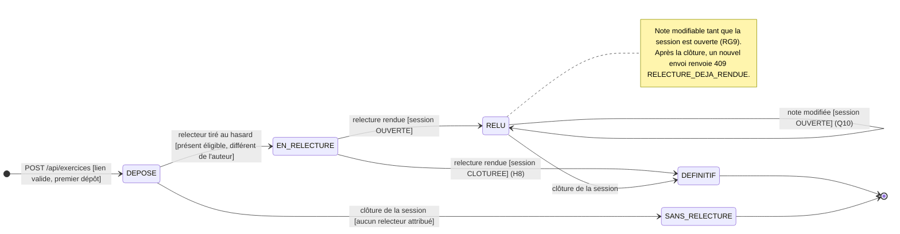

# D4 — Diagramme d'états-transitions : cycle de vie d'un exercice

Candidate : Tedjou Nguimzi Cyntia — Matricule 265. Référence : EF3 à EF6, EF8, RG8, RG9 et section 7 (`docs/CAHIER_DES_CHARGES.md`).

## Description des états

| État | Signification | Relecture associée | Compte dans la moyenne |
|---|---|---|---|
| `DEPOSE` | Exercice enregistré, aucun relecteur éligible pour l'instant (EF4) | aucune | non |
| `EN_RELECTURE` | Relecteur attribué, relecture non encore rendue | `EN_ATTENTE` | non |
| `RELU` | Note et commentaire rendus. La note est encore modifiable. | `RENDUE` | oui (H7) |
| `DEFINITIF` | Note définitive (session clôturée) | `RENDUE` | oui |
| `SANS_RELECTURE` | Session clôturée sans qu'aucun relecteur ait pu être attribué (7.2) | aucune | non |

## Événements refusés (aucun changement d'état)

| Événement | Réponse |
|---|---|
| Dépôt d'un lien qui n'est pas une URL `http(s)` | `400 LIEN_INVALIDE` : aucun exercice n'est créé |
| Second dépôt pour la même session | `409 EXERCICE_DEJA_DEPOSE` : l'exercice existant est inchangé |
| Note absente, non entière ou hors de [0 ; 20] | `400 NOTE_INVALIDE` |
| Relecture soumise par l'auteur de l'exercice | `403 AUTO_RELECTURE` |
| Modification d'une note en état `DEFINITIF` | `409 RELECTURE_DEJA_RENDUE` |

## Remarque

Une relecture encore `EN_ATTENTE` au moment de la clôture reste en état `EN_RELECTURE`. Elle peut encore être rendue une seule fois et devient alors immédiatement `DEFINITIF` (H8). Tant qu'elle n'est pas rendue, elle est comptée dans `relecturesEnAttente` du tableau récapitulatif.
