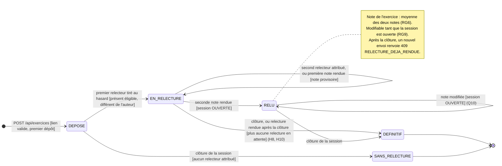

# D4 — Diagramme d'états-transitions : cycle de vie d'un exercice

Candidate : Tedjou Nguimzi Cyntia — Matricule 265. Référence : EF3 à EF6, EF8, RG6, RG8, RG9 et section 7 (`docs/CAHIER_DES_CHARGES.md`). Mis à jour pour la double relecture croisée, évolution imposée à l'Étape 3 (section 7.4).

## Description des états

| État | Signification | Relectures associées | Compte dans la moyenne |
|---|---|---|---|
| `DEPOSE` | Exercice enregistré, aucun relecteur éligible pour l'instant (EF4) | aucune | non |
| `EN_RELECTURE` | Au moins un relecteur attribué, moins de deux notes rendues | une ou deux, dont au plus une `RENDUE` | oui si une note est rendue : note unique, provisoire (RG6, H7) |
| `RELU` | Les deux notes et commentaires sont rendus. Les notes sont encore modifiables. | deux `RENDUE` | oui : moyenne des deux notes (RG6, H7) |
| `DEFINITIF` | Note définitive (session clôturée) | deux `RENDUE`, ou une seule s'il n'y a jamais eu qu'un relecteur (H10) | oui |
| `SANS_RELECTURE` | Session clôturée sans qu'aucun relecteur ait pu être attribué (7.2) | aucune | non |

## Événements refusés (aucun changement d'état)

| Événement | Réponse |
|---|---|
| Dépôt d'un lien qui n'est pas une URL `http(s)` | `400 LIEN_INVALIDE` : aucun exercice n'est créé |
| Second dépôt pour la même session | `409 EXERCICE_DEJA_DEPOSE` : l'exercice existant est inchangé |
| Note absente, non entière ou hors de [0 ; 20] | `400 NOTE_INVALIDE` |
| Relecteur attribué identique à l'auteur de l'exercice | `403 AUTO_RELECTURE` |
| Modification d'une note en état `DEFINITIF` | `409 RELECTURE_DEJA_RENDUE` |

## Remarque

Un exercice dont une relecture est encore `EN_ATTENTE` au moment de la clôture reste en état `EN_RELECTURE`. Cette relecture peut encore être rendue une seule fois (H8) ; l'exercice devient `DEFINITIF` lorsque la dernière relecture en attente est rendue. Tant qu'elle n'est pas rendue, elle est comptée dans `relecturesEnAttente` du tableau récapitulatif.

À la clôture, un exercice qui n'a jamais eu qu'un relecteur, et dont la relecture est rendue, devient `DEFINITIF` : aucune seconde note ne peut plus venir, sa note unique n'est plus provisoire (H10).
